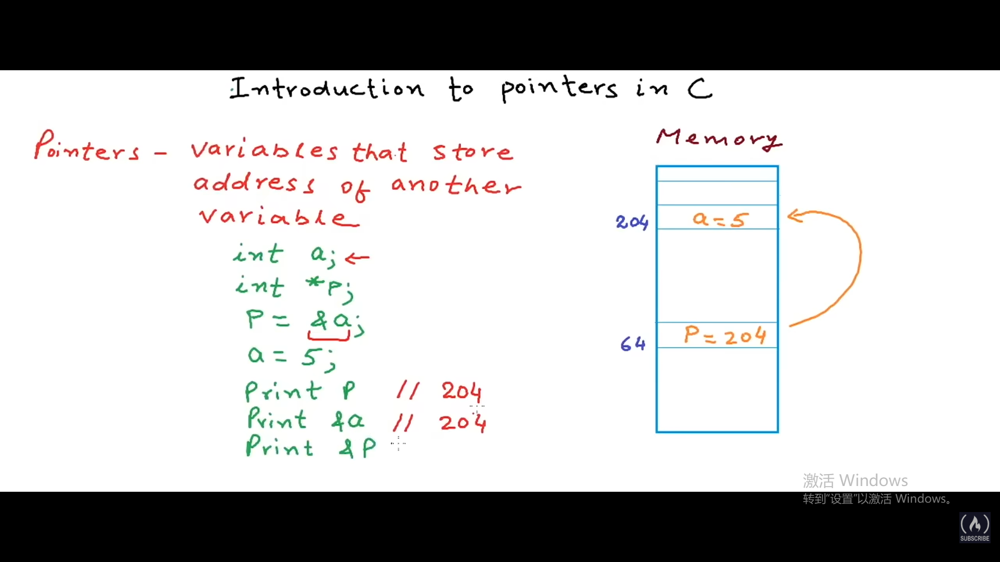

# pointer
a reference that holds a memory address to another variable
## 地址
&变量名

## 数据类型应该与变量一样
```c
int age = 21;
//pointer has its own address but the value store within it is the address of variable age
**int** *pAge = &age；
```
*指针名
在声明的时候用来说明pAge是一个指针的意思

## 命名法 
**p**Age
```c
printf("value of pAge: %p/n", pAge)
```

## dereference
*指针名
在调用的时候说明在取用这个地址上存贮的value
```c
printf("value of age:%d\n", age);
printf("value at stored address: %d\n", *pAge)//value一样,21
```

## default状态assignNULL
```c
int age =21;
int *pAge = NULL;
pAge = &age;
```



