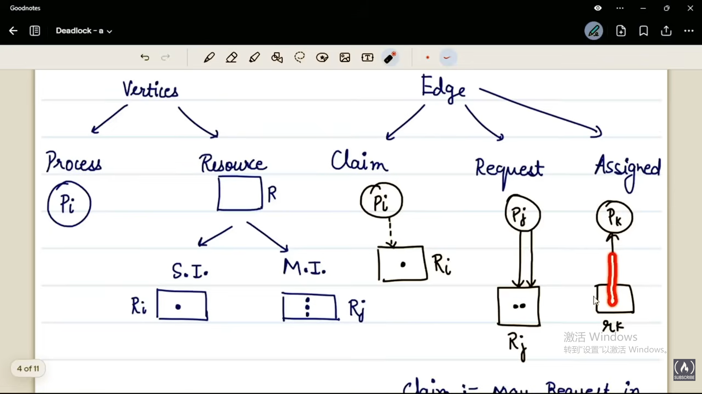

# deadlock
## definition
two or more process are waiting for the happening of the event that is never going to happen

deadlock VS. starvation
blocking for infinite time
blocking for indefinite time
### system modle
progress->request to OS
- if grant
    process use resources->release back to OS
- if deny
    process gets blocked(starve)
    - if os grant the process
        process use resources
    - if os not grant
        forever->deadlock

## necessary condition(all fulfill, likely to happen deadlock)
1. there should be critical section/some shared resource--deadlock
2. process hsould hold some resource and should wait for another resource
3. no forceful snatching of resource
4. circular wait
## resource allocation graph
图示：
claim: may request in future
request: actually requested
assigned； resource allocated to process
## deadlock handling strategies
1. deadlock prevention 
2. deadlock avoidance--bankers algorithm
3. deadlock detection and recovery--doctor's algorithm
4. deadlock ignorance--ostrich algorithm(no strategy)
### ostrich algo
windows/unix-linux uses ostrich algorithm because deadlock occurs very rarely and cost of prevention is high
### deadlock prevention
how to prevent: by remove the necessary condition of deadlock
1. remove critical section--practically impossible
2. hold and wait:instead hold and wait can we change it into hold or wait
protocol 1 -All or nothing
process will ask for all< r1,r2,r3 >resources before the beginning of phase1
protocol 2 -release and request
after phase1 will release r1 and r2 and will ask for new resources
no holding of resources but there is no guarantee that it will get resource imdiatedly
3. no preemption
preemption from process are two types:
- forceful: tunning process should not get block
running process got the right to snatch away resources of ready processes
- self: adopt selfless attitude
running process finds out the resource it need is not available so instead of snatching the resource, it will release the resource it acquire thinking that others might need the resource
4. circular wait
assign unique number to each resource, implementing linearity to avoid circularity
### deadlock avoidance
1. single instance--resource allocation graph algorithm
2. multi instance--banker algorithm

both algorithm are based on apriori knowledge(process should know what resources it need in future while executing)

1. operating system either grants or deny based on the resulting system state
if a cycle may present--unsafe state
if no cycle--safe state

2. Banker's algorithm
fixed process-fixed resource
m=the process number in OS
n=the number of resources

- Available: ARRAY[1..M] of integer
系统中可以提供的资源数量
- Max: ARRAY[1..N,1..M] of integer
当前每一个进程对某一个资源的最大需求量
Max[i,j]=k process i requires k numbers of resource j
- Allocation: ARRAY[1..N,1..M] of integer
当前系统中哪些进程得到了哪些资源
Aloc[i.j]=a process i only allocate a numbers of resource j(a<=j)
- Need: ARRAY[1..N,1..M] of integer
这个进程还需要多少资源
Need[i,j]=b process i need b more numbers of resource j (b=k-a)
- Request:ARRAY[1..N,1..M] of integer
本次进程对资源的申请是多少
Req[i,j]=c at time t request made by preocess i at time t 
- Total[1..m]
Total[j]=z there are z copies of resource j in the system
- Available[1...m]
Avail[j]='e' there are e number of resource j free availble ar time t

### deadlock detection and recovery
OS notice the symptons like:
- under utilization of CPU
- majority processes are getting blocked
1. single instance--wait for graph
2. multi instance--banker algorithm

wait for graph(only contain processes)
- remove the resources in RAG and just keep the processes
- run cycle detection algorithm(for single instance, if there is a cycle there is deadlock)
- victim process will be sent to the recovery module

multi instance
system is safe if request of all processes is satisfied with available copies in some order

recovery module
either it works with processes or works with resources
- process
    - abort one processes at a time until the elimination of deadlock cycle
    - abort all deadlocked processes
    which process to kill? The one who has just started
        then apply the detection algorithm again and again
- resources
  - preemption
    we will keep preemptung the latest resources add them to acailable pool and then run the detection algorithm after preemption, will keep preempting until cycle is broken
  - rollback

