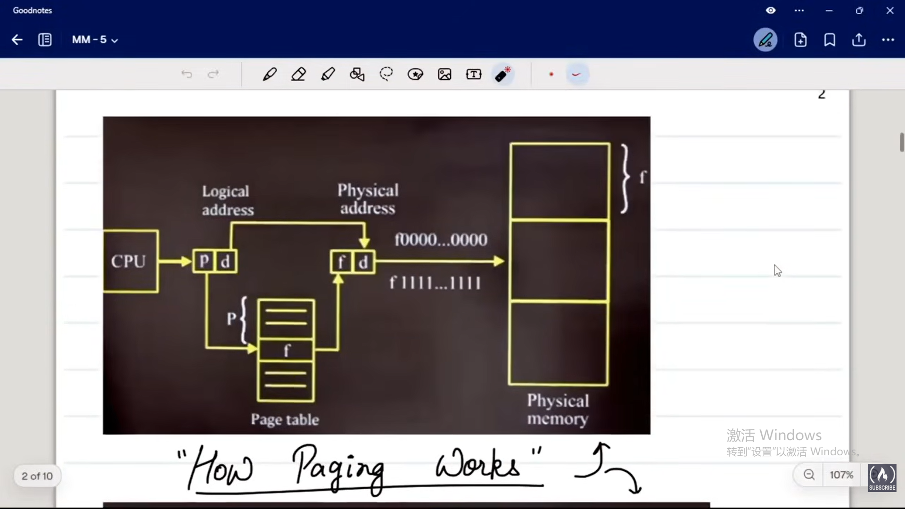

# memory management
memory(data and instruction)-->Primary[RAM+ROM+Cache+register]
RAM: Main memmroy
ROM: file system
## Address space
a set/group of words associated with addresses
- logical address space/virtual address space
相对地址
- physical address space
绝对地址

process in cpu(generate n bits logical address)---->memory management unit-->physical address of instruction(only can be accessed by OS)

each logical address corresponds to a word in main memory
OR
each logical address correspond to a physical address
word 是储存单位，物理地址和储存单位一一对应，有按字节编址和按字编址
## linear one dimensional view of memory
linear array of words
word : collection of bytes
word length: if 1 word = m byte then each cell in the memory consist of m byte
word content: data and instruction
each word has a unique address
and to access the content of a word, we must have an address
with n-bit address->access $2^{n}$word
memory sizes= $2^{n} * m$= number of words x width of word

address bus->RAM<--data bus-->CPU
--read-->
--write-->
Block diagram of typicla RAM chip


bus: group of wires
read/write: control signal
pass the control signal either 10(read) or 01(write). Then from data bus content will reach the CPU

## laoding and linking

### loading
- static 
the whole program us loaded in memory before execution
drawback:possible wastage of space
advantage: faster loading
- dynamic
on demand loading
drawback:slower execution
advantage:saving memory

### linking
the process of resolving external reference
suppose in a program whenever a compiler confronts a function which has not been defined before
left a BSA address blank---unresolved reference
```txt
the compilation starts from the first line
the execution starts from main()
```
linker is the module of OS who is going to fill up these blanks.
#### static linking
linking is done before execution
.c--compiler-->.obj contains unresolved references--linking-->.exe

#### dynamic linking
linking done at runtime

stub: every unresolved reference will be associated with a small piece of code
linker will first look for it in the memory->if no, look in the compiler libraries
linker will find the address-> loader will load that module in memory->linker will provide it to stub->to the BSA
modules/library which are linked ar runtime by dynamic linking are generally called as .all dynamic link libraries
can change the library implementation without affecting the application
the lobrary implementation can be changed without affecting the application


### Address binding
association of program instruction and data units to memory locations is address binding

job of liners is to find addresses of these external objects, functions, variables

#### binding time
compile time load time and runtime
e.g
int x;
x=1;
name binding: compile time
type binding: compile time
address binding:load time
value binding: runtime
size binding: compile time


static binding
name type address size
dynamic binding
value

#### types of address binding
1. compile time binding
offset of data units and instructions are decided by the compiler

2. load time
loader will generate the real time address based on the communication with memory manager
the instructions are swept out and the location remain empty until the instruction swapped in
during execution the instruction and data unit address don't change
3. runtime
done by loader itsel but, when swapped in can be loaded to different place

## memory management techniques
### functions and goals of memory management
1. allocation
before loading the process you have to first allocate the memory
2. protection
a process should not interfere with the space of other process
area of memory where program is loaded is program address space
process's address space should get its instruction executed in its own address space only---NO TRESPASSING
3. free space management
4. address translation
5. deallocation
goals: minimize fragementation(wastage)
abillity to manage larger program in small memeory area
### contiguous(centralized)
#### overlays
replace
#### partition
1. fixed partition: multiprogramming with fixed tasks
memory will be divided into fixed number of partitions, the partitions may be of different size

```
from CPU scheduling, we learn how from main memory which process should go to the CPU, 
in partition allocation we will learn from hard disk at which place the program should go
```
- Partition allocation policy
  1. first fit---first free big enough(search from th first partition)
  2. best fit---least internal fragmentation(smallest free big enough)
  1. next fit---search from the last partition
  2. worst fit---largest big enough(maximizing the internal fragmentation)

2. variable partition
multiprogramming with variable tasks
partition is made depend on the process
the rest are left as free hole
when new process come, new partition is made, creating new free hole

```
the difference of internal fragmentation vs. external fragmentation:
in fixed partition:
one partition is for one process only, the rest is called internal

in dynamic partition
one process comes in and the rest is free hole,the new small free hole which may not accomodate new process
```
##### Solution to external fragmentation
1. compaction:
relocating the process to one end of memory to create bigger free hole
note that the processes' location are changed, so it must support the run time address binding
->undesirable solution: time consuming operation

2. non-contiguous allocation
break the progress into different part to fit in different free holes
compaction is not automatic but if two free holes are adjacent then they are automatically merged

### non-contiguous allocation
to prevent external fragmentation
#### the design and implementation of NonContiguous techniques
1. simple paging
    1. organization of Logical address space
logical address space are divided into equal size unit called pages
in RAM we have frame, which is of the same size with page
        there are many words in page, so which word we want to access from a particular page is called as page offset--how many bits you need to identify a word in a page
        page offset(d)=log2(page size)

    2. logical address format
        first part--which page 
        second part--which word

    3. organization of memory management unit
        - each process has its own page table
        - page tables are stored in memory
        - page table are organized as set of entries known as page table entries
        - number of entries in page table = number of pages
        - (one page entry is like: page num & frame number & etc.)
        -  
2. the performance of paging
    1. timing issue--page table is stored in memory
       1. main memory access time=m nanoseconds
       2. effective memory access time=2m(actual time take) the second m is used for access main memory
       3. ?how to make effective memory time closer to maim memory time
            - store some of the entries in cache memory, which has a faster access time
            - Cache is also known as Translation Lookaside Buffer
            - TLB hit and TLB miss
       4. physical address cache: reduced final access time---when we have the physical address, go and find in PAC first
    2. size issue--hache paging
    3. multilevel paging
        access the inner page table through outer page table
```
paging as concept generally involve 3 steps:
- divide the address space(group of words associated with addresses) into pages
- storing the pages in physical address space
- accessing the pages with the help of page table
```
3.  segment
in users view, a program is devided into segment
the segment are assumed to be stored ar their intirety at non contiguous locations in memory
there is no concept of frames in segmentation wherever free hole is present store the segment. It's like variable partitions
there is segment table
logical address=>segment no.+offset

4. paging vs. segementation
没听

## virtual memeory
virtual memory is mapped on disk

demand page
we have to refer page from disk
1. process causin page fault will get blocked
we have to read the page from disk->IO operation->block
2. mode shifting(from user mode->kernel mode)
3. vitual memory manager will be on CPU taking charge, summoning disk manager to find the negative oage and handle the copy of that page to virtual memory manager
4. now virtual memory manager will try to save that copy to main memory
   1. if the frame is empty->save the page->unblock the process i->ready stage->continue
   2. if the frame is not empty->swap a page out from the memory (put it back to disk) and swap in 

type of demand paging
1. pure demand paging
in implementation of virtual memory three types of address spaces are involved
- physical address space(in main memory)
- vitural address space(vitual memory)
- disk address space
PAS<=VAS largere program should be able to execute is smaller area
PAS<=VAS<=DAS size of virtual memory is limited by disk size

1. 


## thrashing

if page size is small -> more pages-> high page fault
if page size is large-> feweer pages-> low page fault

that means that the process gets block most of the time(more time spend on page fault service)
therefore, it wil decrease the CPU utilization

thrashing control strategies
- prevention 
by controlling the degree of multiprogramming(long time scheduler)
- detection 
if we find:
  - the degree of multiprogramming is high, but low CPU utilization
  - no. of process getting more to be blocked
  - high disk utilization
- recovery
  process suspension(midterm scheduler)

## working set strategy
to minimize page fault rate and also utilize memory efficiency
it works on principle of locality of reference

see the locality first and demand accordingly
use locality of references->dynamic frame allocation


```
main(){        \\10kb
    f(){       \\2kb
        g(){   \\28kb
            scanf()
        }
    }
}
```
when in main()->loading 10 pages 
when in f()->2 pages, doesn't need that 10 pages anymore


working set window=set of unique pages referred in the references string during the past $\Delta$ references