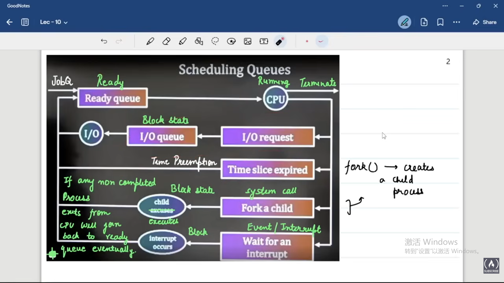
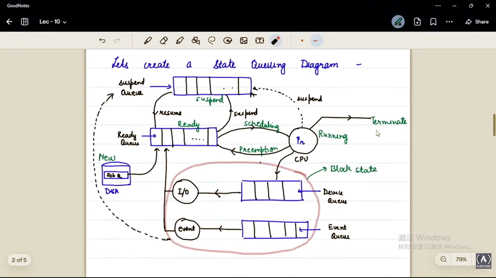
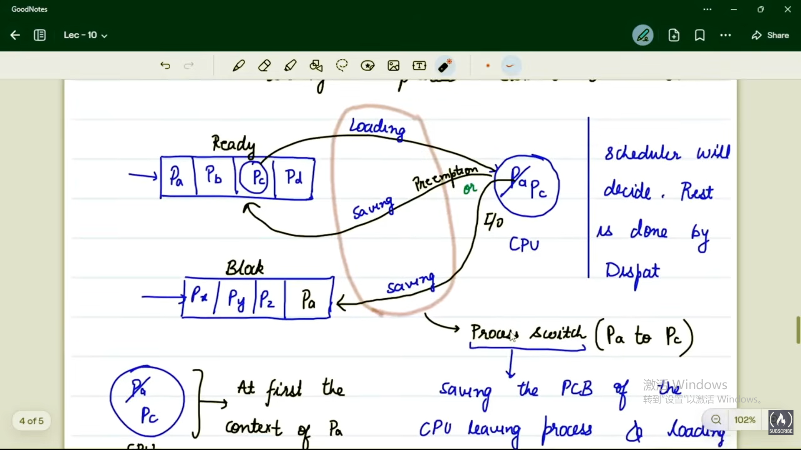

# Queue
## definition
a data structure which follows FIFO discipline
two type of queue:
1. on disk 
   1. job queue(new state)
   contain programs ready to be loaded in memory
   2. suspend queue(suspend block & ready state)
   list of processes that gets suspended form memory onto disk
2. on memory
   1. ready queue(ready state)
   contains the list of PCBs of ready process
   2. block queue(blocked state)
   contains the list of PCB that get blocked onto that device, each IO device will have its own queue(device queue)

## state queue diagram

## schedulers & dispatcher
### scheduler
- scheduling means making a decision in which queue 
  - job queue
  - ready queue
  - suspend queue
- scheduler is part of the OS. The type of the scheduler
  - long term scheduler: from job queue --> ready queue(new state --> ready state )
  - short term scheduler(CPU scheduler): from ready state --> running state
  - medium term scheduler(swapped): process suspension & resuming 
- long term scheduler controls the **degree of multiprogramming**(how many process will go from hard disk to main memory)
### dispatcher
only work with the short time scheduler
responsible for carrying out the activity of **context switching**
- context switching: the activity of loading and saving the process during a **process switch** on CPU
- process switch: saving the PCB of the CPU leaving process and loading the PCB of the next process
- the time takes by dispatcher to do this is **Context switch time** or **dispatch latency** or **CPU scheduling overhead**

