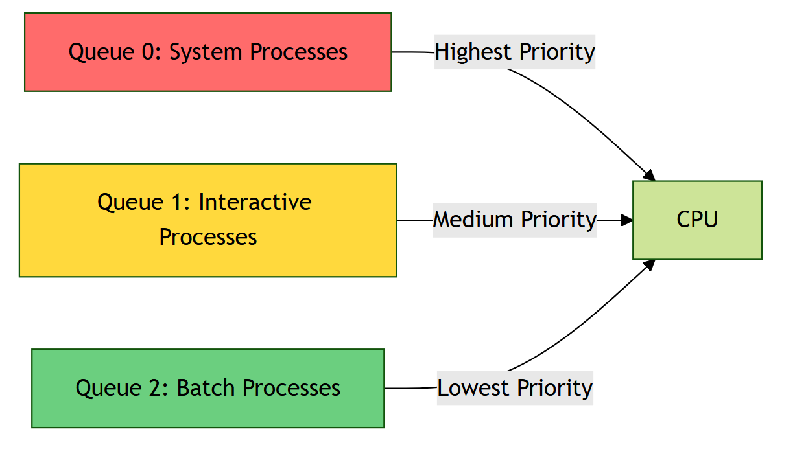

# CPU scheduling
Design and implementation od Short term schedule

- function of short time scheduler
select a process from ready queue to run on the CPU 
- goal of short time scheduler
maximize CPU utilization, throughput, efficiency,
minimize waiting time, turn around time, response time

## process time
1. arrival time: the time at which process enters the ready queue for the first time
*new state -->ready state*
2. waiting time: the time spent by the process waiting in the ready queue
*ready state···*
3. burst time: the time spent by the process running on CPU
*running state···*
4. IO burst time: time spent by the process waiting for IO operation in blocked state
*blocked state···*
5. completion time: the time spent by the shifting the process running to terminate
*running state --> terminate state*
6. turn around time: the lifetime of the process
*new state --> terminate state*
**turn around time** = ready time + running time + block time
**waiting time** = turn around time -(burst time + IO burst time)
7. schedule length: total time taken to complete all n process as per **schedule**
schedule time = completion time of the last process - arrival time of the first progress

   - what is schedule?
th order in which the process gets complete
   - how many schedules possible with n process?
=$n!$ in **non pre-emptive case**(a process must complete then come the next process)
=$\infty$ in **pre-emptive** case(a process can be moved from running state back to the ready queue before it finished execution)

   - what is Throughput?
    number of processes completed per unit time 
    = $\frac{n}{schedule time}$

8. context switching time or scheduling overhead
the time taken by the dispatcher to load the PCB from ready queue onto CPU(the extra time spends on activities context switching, )

## CPU scheduling types

preemptive non preemptive

CPU bound precess: performs lots of computation in CPU, little IO
IO bound process: performs lots of IO short CPU

## some algorithm
### First come first leave
selection criteria: arrival time
mode of operation: non preemptive
conflict resolution: lower process ID

assumptions: 
- time is in clock time
- no IO burst time
- scheduling overhead = 0

problem:
starvation
### shortest job first
based on burst time
among the process present in already in ready queue(notation: arrival time)
### shortest remaining time first
selection criteria: arrival time
mode of operation: preemptive
conflict resolution: lower process ID
NOTE:preemption of running process is based on the availability of strictly shorter process

out of thr processes present in ready queue select the one having least burst time & we will continue to run CPU that process until a new process arrives with shorter(not equal) burst time

act like SJF when no new process stop coming--the pre emptive stops

**performance of SJF SRTF**
they are all optimal algorithm
both favours shorter process
advantaged: more jobs in less duration--minimize the throughput, minimizing the average TAT
disadvantages: starvation to longer process
**issue**
!we can not know the burst time at prior, so these algorithm cannot be implement practically
- SJF can be implemented by predicted burst time
#### Prediction techniques for CPU bursts
**technique**
1. static(look at the total burst time)
   1. on basee of size
   2. on bases od types
2. dynamic
   - **exponential averaging technique**: back substitution

### highest response ratio next
selection criteria: response ratio= $\frac{waiting time+burst time}{burst time}$
waiting time↑ response ration↑
burst time↓ response ration↑

### longest remaining time first
selection criteria: burst time
mode of operation: pre-emptive
conflict resolution: lower process ID
### priority based scheduling
it works exactly like SJF/SRTF except that it looks for priority instead of burst time

selection criteria: **priority**(level of importance of process)
mode of operation: non/pre-emptive
conflict resolution: lower process ID

f(type, size, resources...)=priority

### round robin 
it is used in preemptive based multiprogramming time sharing operating system
if the process fails to execute all its instruction in given time quantum then OS wil preempt it & it will go to the end of ready queue
improve interactiveness
selection criteria: arrival time + **time quantum**
mode of operation: pre-emptive
### multilevel queue scheduling
all algorithm which we have read above was based on **single ready queue system**

#### better version: multiple ready queue
different scheduling algo can be applied to different queue

**rule**
the highest priority process should be scheduled first then lower priority processes can be scheduled(be emptied)

priority:such as priority level, process type, or memory requirements.

**issue**
starvation to the process lying on the low level
#### better version: multilevel feedback queue scheduling
put a preference on short-lived processes
processes starts ar the highest priority queue. After each time quantum, if they are not finished, they are penalize and move to lower queue which runs with the longest quantum.